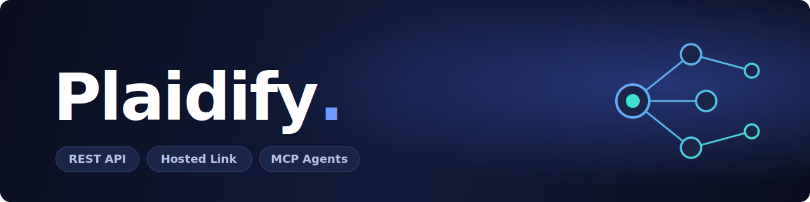
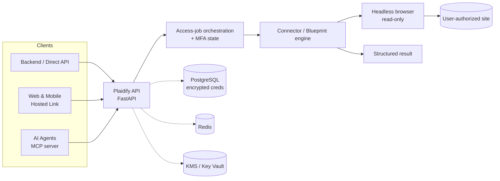

<div align="center">



<h3>The open-source gateway to authenticated web data.</h3>

<p>Connect to any user-authorized website, clear MFA, and return structured data —<br>through a REST API, a Plaid-style hosted link, or an MCP server for AI agents.</p>

<p>
  <a href="https://github.com/meetpandya27/plaidify/actions/workflows/ci.yml"></a>
  <a href="LICENSE"></a>
  
  
  <a href="https://github.com/astral-sh/ruff"></a>
  <a href="CONTRIBUTING.md"></a>
</p>

<p>
  <a href="#quick-start"><b>Quick Start</b></a> ·
  <a href="docs/README.md"><b>Documentation</b></a> ·
  <a href="#sdks"><b>SDKs</b></a> ·
  <a href="#architecture"><b>Architecture</b></a> ·
  <a href="#production-readiness"><b>Production</b></a> ·
  <a href="CONTRIBUTING.md"><b>Contributing</b></a>
</p>

</div>

---

## Overview

Plaid connects apps to **banks** through official APIs. Plaidify connects apps to **any website** through a secure, headless browser runtime — logging in with user-authorized credentials, handling MFA, and returning typed, structured data under a strict **read-only** posture.

Use it three ways, from the same engine:

| Surface | Use it when | Primary endpoints |
| --- | --- | --- |
| **Direct API** | Your backend owns the connect flow and polling lifecycle | `POST /connect`, `POST /mfa/submit`, `GET /access_jobs` |
| **Hosted Link** | You want a Plaid-style launch flow in web or mobile clients | `POST /link/sessions`, `POST /link/bootstrap`, `POST /link/sessions/bootstrap` |
| **Agents & MCP** | An internal tool or AI agent needs constrained access to a workflow | `GET /blueprints`, agent routes, built-in MCP server |

> [!NOTE]
> Plaidify never writes to target sites. Every flow runs through read-only browser guardrails, scoped access tokens, consent grants, and a tamper-evident audit log.

## Architecture



Plaidify is a FastAPI service with modular routers, Redis-backed shared state for multi-worker coordination, a detached access-job execution path for restart-tolerant production runs, and hosted-link assets that embed in parent apps or native webviews.

## Quick Start

### Try the whole flow in one command

Run a complete, self-contained journey — register, connect, MFA, and structured extraction — against a bundled demo site. No external site, API keys, or setup required:

```bash
python scripts/demo.py
```

This spins up a demo target site plus the Plaidify API, then drives the full stack (auth → connector execution → headless browser → MFA → typed data). Use `--no-mfa` for the no-MFA path, or `--base-url https://your-plaidify` to smoke-test an existing deployment (set `DEMO_MODE=true` there). The bundled `demo_utility` connector is only discoverable when `DEMO_MODE=true`, so it never leaks into production discovery.

### Docker Compose

```bash
cp .env.example .env
# Set ENCRYPTION_KEY and JWT_SECRET_KEY before starting
docker compose up --build
curl http://localhost:8000/health
```

### Local development

```bash
cp .env.example .env
# Set ENCRYPTION_KEY and JWT_SECRET_KEY before starting
alembic upgrade head
uvicorn src.main:app --reload
```

Interactive API docs are served at `http://localhost:8000/docs`.

## SDKs

First-party clients for server, web, and native targets:

| SDK | Language | Path |
| --- | --- | --- |
| Server | Python | [sdk/](sdk/README.md) |
| Web & Node | TypeScript / JavaScript | [sdk-js/](sdk-js/README.md) |
| iOS | Swift | [sdk-swift/](sdk-swift/) |
| Android | Kotlin | [sdk-android/](sdk-android/README.md) |

## Production readiness

Plaidify is built to run in production, not just to demo. The hardening is in the repo and exercised in CI:

| Area | What's built in | Reference |
| --- | --- | --- |
| **Security** | Envelope encryption with pluggable KMS (Local / AWS / Azure / Vault), OAuth2 social login, RBAC, scoped API keys, tamper-evident audit hash chain, security headers | [SECURITY.md](SECURITY.md) · [THREAT_MODEL.md](docs/THREAT_MODEL.md) |
| **Resilience** | Circuit breakers, retry-with-backoff, rate-limit fail-open, bounded health probes, graceful shutdown | [HIGH_AVAILABILITY.md](docs/HIGH_AVAILABILITY.md) |
| **Observability** | Prometheus metrics + alert rules, provisioned Grafana dashboard, OpenTelemetry tracing, Sentry | [monitoring/](monitoring/README.md) |
| **Data & DR** | GDPR account erasure, scheduled backups, documented restore/failover drills | [DISASTER_RECOVERY.md](docs/DISASTER_RECOVERY.md) |
| **Compliance** | SOC 2 / ISO 27001 controls matrix + pre-audit checklist | [COMPLIANCE.md](docs/COMPLIANCE.md) |

CI runs lint, a 3.10–3.12 test matrix (800+ tests), a hosted-link Playwright E2E slice, `pip-audit`, CodeQL, secret scanning, and a Docker build on every change.

## Features

- **Read-only by design** — browser guardrails, scoped tokens, consent grants, and an immutable audit trail.
- **MFA handling** — detached access jobs capture and continue MFA via the hosted link or `POST /mfa/submit`.
- **Encryption everywhere** — credentials are envelope-encrypted at rest with per-user keys; TLS/HSTS in transit.
- **Hosted Link** — launch flows for browser, iframe, and native mobile webview clients, with signed bootstrap tokens.
- **Agent-native** — a built-in MCP server and blueprint discovery for constrained AI-agent access.
- **Restart-tolerant** — Redis-worker execution mode keeps detached jobs durable across restarts.

## Documentation

| Guide | Description |
| --- | --- |
| [docs/README.md](docs/README.md) | Architecture & configuration reference |
| [docs/SELF_HOST.md](docs/SELF_HOST.md) | Fork-to-deployed Azure walkthrough |
| [docs/DEPLOYMENT.md](docs/DEPLOYMENT.md) | Production deployment & operations |
| [docs/MOBILE_LINK_INTEGRATION.md](docs/MOBILE_LINK_INTEGRATION.md) | Native mobile hosted-link integration |
| [docs/AGENTS.md](docs/AGENTS.md) | Agent-facing usage and the MCP server |
| [docs/HIGH_AVAILABILITY.md](docs/HIGH_AVAILABILITY.md) | HA & multi-region topology |
| [docs/DISASTER_RECOVERY.md](docs/DISASTER_RECOVERY.md) | Backup, restore, and failover |
| [docs/RUNBOOK.md](docs/RUNBOOK.md) | Day-2 operational procedures |

## Production notes

- Use PostgreSQL and Redis in production.
- Prefer `POST /link/bootstrap` + `POST /link/sessions/bootstrap` for hosted client launches.
- Keep `CORS_ORIGINS` explicit and enable HTTPS enforcement.
- Run detached access jobs in Redis-worker mode for restart-tolerant behavior.
- Treat fixture connectors as local test assets, not public production integrations.

## Testing

```bash
# Full suite
PYTHONPATH=$PWD python -m pytest tests/ -q

# Targeted slices
python -m pytest tests/test_agent_integration.py -q
PYTHONPATH=$PWD python -m pytest tests/test_hosted_link_e2e.py -q -m playwright
cd sdk-js && npm run typecheck && npm test
cd sdk-swift && swift test
```

Install the browser once before the hosted-link E2E slice:

```bash
python -m playwright install chromium
```

## Contributing

Contributions are welcome. See [CONTRIBUTING.md](CONTRIBUTING.md) and the [Code of Conduct](CODE_OF_CONDUCT.md). Found a security issue? Please follow [SECURITY.md](SECURITY.md) for responsible disclosure.

## License

[MIT](LICENSE) © Plaidify contributors.
