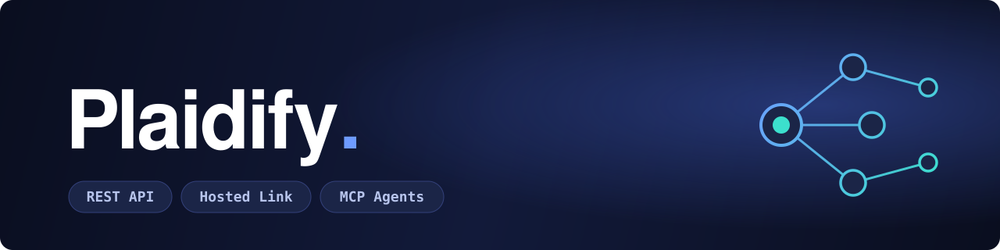
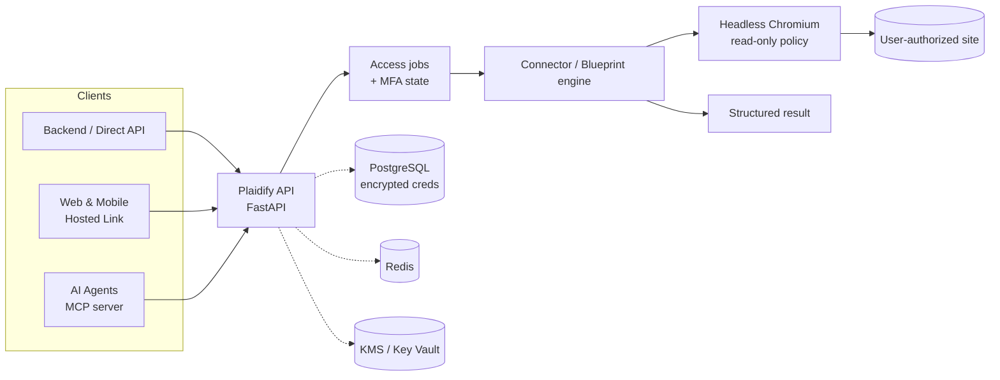

<div align="center">



<h3>The open-source gateway to authenticated web data.</h3>

<p>Connect to any user-authorized website, clear MFA, and return structured data —<br>through a REST API, a Plaid-style hosted link, or an MCP server for AI agents.</p>

<p>
  <a href="https://github.com/meetpandya27/plaidify/actions/workflows/ci.yml"></a>
  <a href="LICENSE"></a>
  
  
  <a href="https://github.com/astral-sh/ruff"></a>
  <a href="CONTRIBUTING.md"></a>
</p>

<p>
  <a href="#quick-start"><b>Quick Start</b></a> ·
  <a href="docs/README.md"><b>Documentation</b></a> ·
  <a href="#sdks"><b>SDKs</b></a> ·
  <a href="#architecture"><b>Architecture</b></a> ·
  <a href="#production-readiness"><b>Production</b></a> ·
  <a href="CONTRIBUTING.md"><b>Contributing</b></a>
</p>

</div>

---

## Overview

Plaid connects apps to **banks** through official APIs. Plaidify connects apps to **any website** through a headless browser runtime — logging in with user-authorized credentials, handling MFA, and returning typed, structured data under a **read-only** policy.

Use it three ways, from the same engine:

| Surface | Use it when | Primary endpoints |
| --- | --- | --- |
| **Direct API** | Your backend owns the connect flow and polling lifecycle | `POST /connect`, `POST /mfa/submit`, `GET /access_jobs/{job_id}` |
| **Hosted Link** | You want a Plaid-style launch flow in web or mobile clients | `POST /link/bootstrap`, `POST /link/sessions/bootstrap`, `GET /link?token=…` |
| **Agents & MCP** | An internal tool or AI agent needs constrained access to a workflow | `GET /blueprints`, `/agents`, `/consent`, `python -m src.mcp_server` |

> [!NOTE]
> Plaidify is built not to write to the sites it reads: every phase of a run is held to read-only rules (declared login and logout targets, no form submissions after login, blocked private-network addresses), and access goes through scoped keys, consent grants and a tamper-evident audit log. The rules and their known limits are in [SECURITY.md](SECURITY.md).

## Architecture


```mermaid
flowchart LR
  subgraph Clients
    A[Backend / Direct API]
    B[Web & Mobile<br/>Hosted Link]
    C[AI Agents<br/>MCP server]
  end
  A --> API
  B --> API
  C --> API
  API[Plaidify API<br/>FastAPI] --> JOBS[Access jobs<br/>+ MFA state]
  JOBS --> ENGINE[Connector / Blueprint engine]
  ENGINE --> BROWSER[Headless Chromium<br/>read-only policy]
  BROWSER --> SITE[(User-authorized site)]
  ENGINE --> OUT[Structured result]
  API -.-> PG[(PostgreSQL<br/>encrypted creds)]
  API -.-> REDIS[(Redis)]
  API -.-> KMS[(KMS / Key Vault)]
```

Plaidify is a FastAPI service with modular routers, Redis-backed shared state for multi-worker coordination, an optional separate executor process for access jobs (`ACCESS_JOB_EXECUTION_MODE=redis-worker`), and a hosted Link page (React, in `frontend-next/`) that embeds in parent apps or native webviews.

## Quick Start

Plaidify runs on Python 3.11–3.13. Install the hash-locked dependencies and the browser once:

```bash
python -m venv .venv && source .venv/bin/activate
pip install --require-hashes -r requirements-dev.lock
python -m playwright install --only-shell chromium   # add --with-deps on a fresh Linux host
```

### Try the whole flow in one command

```bash
python scripts/demo.py
```

This starts a bundled demo site and the Plaidify API (on `127.0.0.1:8000`, with throwaway secrets and a temporary SQLite database), then drives the whole journey: register → `/connect` → MFA → poll the access job → structured data. The default site, `demo_utility`, asks for a one-time code (`123456`, entered for you). `--site demo_saas` takes the no-MFA path, `--site demo_bank` a security question, and `--all` runs every bundled site. `--base-url https://your-plaidify` drives an existing deployment instead (it must run with `DEMO_MODE=true` and reach the demo portal). The sandbox connectors are only discoverable when `DEMO_MODE=true`.

`python scripts/demo.py --serve` keeps the sandbox running for manual exploration; `docker compose -f docker-compose.demo.yml up --build` does the same in a container on `127.0.0.1:8000`. The hosted page needs a session token: register, then create a session and open its URL:

```bash
TOKEN=$(curl -s -X POST http://127.0.0.1:8000/auth/register -H 'Content-Type: application/json' \
  -d '{"username":"alice","email":"alice@example.org","password":"Str0ng-passw0rd!"}' | jq -r .access_token)
curl -s -X POST http://127.0.0.1:8000/link/sessions -H "Authorization: Bearer $TOKEN" \
  -H 'Content-Type: application/json' -d '{"site":"demo_saas"}' | jq -r .link_url
# open http://127.0.0.1:8000/link?token=... and sign in with the credentials shown on the demo site
```

### Docker Compose

The development stack (API, PostgreSQL, Redis, and a one-shot migration job) reads its database and Redis passwords from `.secrets/`:

```bash
cp .env.example .env
python3 -c 'import base64,os; print("ENCRYPTION_KEY=" + base64.urlsafe_b64encode(os.urandom(32)).decode())' >> .env
python3 -c 'import secrets; print("JWT_SECRET_KEY=" + secrets.token_hex(32))' >> .env
mkdir -p .secrets && chmod 700 .secrets
openssl rand -base64 32 > .secrets/postgres_password
openssl rand -base64 32 > .secrets/redis_password
chmod 644 .secrets/*   # containers read these as non-root users (.secrets/README.md)
docker compose up -d --build
curl http://127.0.0.1:8000/health
```

Every port listens on `127.0.0.1` only. Details, the production stack (nginx, a separate executor, backups) and every setting: [docs/DEPLOYMENT.md](docs/DEPLOYMENT.md).

### Local development

```bash
cp .env.example .env        # then set ENCRYPTION_KEY and JWT_SECRET_KEY (commands in the file)
alembic upgrade head        # SQLite by default
(cd frontend-next && npm ci && npm run build)   # the hosted Link page served at /link
uvicorn src.main:app --reload
```

Interactive API docs are served at `http://localhost:8000/docs` (outside production; in production only with `DOCS_ENABLED=true`).

## API at a glance

- API keys (`pk_…`, agent keys `pk_agent_…`) travel only in the `X-API-Key` header; user access tokens (from `POST /auth/token`) as `Authorization: Bearer`.
- Secrets travel only in JSON bodies: `POST /connect`, `POST /mfa/submit {session_id, code}`, `POST /submit_credentials`, `POST /fetch_data {access_token, consent_token?}`.
- `POST /connect` needs an API key, an access token, or the `link_token` of a live hosted-link session. It answers `connected` with the data, `mfa_required` (answer with `POST /mfa/submit`), or `pending` with a `job_id` to poll at `GET /access_jobs/{job_id}`.
- Webhooks are signed: `X-Plaidify-Signature: sha256=<hex HMAC-SHA256 of "{X-Plaidify-Timestamp}." + raw body>`.

The full, current contract is the OpenAPI schema at `/openapi.json`; [docs/README.md](docs/README.md) maps it.

## SDKs

First-party clients for server, web, and native targets. **None is published to a package registry yet**; install them from this repository.

| SDK | Language | Path | Install from source |
| --- | --- | --- | --- |
| Server + CLI | Python | [sdk/](sdk/README.md) | `pip install ./sdk` |
| Web & Node | TypeScript / JavaScript | [sdk-js/](sdk-js/README.md) | `cd sdk-js && npm ci && npm run build`, then `npm install <path>/sdk-js` |
| iOS | Swift | [sdk-swift/](sdk-swift/README.md) | Add the `sdk-swift` folder as a local Swift package |
| Android | Kotlin | [sdk-android/](sdk-android/README.md) | Include the `:core` / `:ui` Gradle modules |

## Production readiness

Plaidify has not been released or run in production yet (see the [CHANGELOG](CHANGELOG.md)). What the repository contains:

| Area | What's built in | Reference |
| --- | --- | --- |
| **Security** | Envelope encryption with per-user keys and pluggable KMS (local / AWS / Azure / Vault), key rotation, scoped API keys and agents, consent grants bound to agents, admin RBAC, OAuth2 social login, sign-in throttling, HMAC-keyed audit hash chain, read-only browser policy with a private-network block and Chromium's sandbox | [SECURITY.md](SECURITY.md) · [THREAT_MODEL.md](docs/THREAT_MODEL.md) |
| **Reliability** | Separate executor with heartbeats, per-credential locks, a reaper for stuck jobs and a graceful drain; a durable webhook outbox; scheduled refresh from the database under a lease; circuit breakers and retries | [DEPLOYMENT.md](docs/DEPLOYMENT.md#process-management) · [HIGH_AVAILABILITY.md](docs/HIGH_AVAILABILITY.md) |
| **Observability** | Prometheus metrics (multiprocess), alert rules with `promtool` tests, a provisioned Grafana dashboard, OpenTelemetry tracing, Sentry | [monitoring/](monitoring/README.md) |
| **Data & DR** | Account erasure, retention jobs, encrypted and verified `pg_dump` backups (opt-in compose service, Kubernetes CronJob). No restore drill has been run yet. | [DISASTER_RECOVERY.md](docs/DISASTER_RECOVERY.md) |
| **Deployment** | Hardened image (non-root, read-only app code, hash-locked dependencies), compose stacks, an Azure Container Apps template (never deployed yet) | [DEPLOYMENT.md](docs/DEPLOYMENT.md) · [AZURE_DEPLOYMENT.md](docs/AZURE_DEPLOYMENT.md) |
| **Compliance** | SOC 2 / ISO 27001 controls matrix — a readiness aid, not a certification | [COMPLIANCE.md](docs/COMPLIANCE.md) |

**Before going live**, work through the owner checklist in [RUNBOOK.md](docs/RUNBOOK.md#before-going-live-owner-checklist) (repository settings, package names, production secrets, a restore drill).

### What CI runs

On every pull request and push to `main` ([ci.yml](.github/workflows/ci.yml)): ruff lint and format checks over the whole repository; a check that the hash-locked requirement files match their sources, `pip-audit` of every lock and `npm audit` of the shipped npm packages; the Python suite (about 1,700 tests) with coverage on Python 3.11, 3.12 and 3.13 against a real Redis, plus the Python SDK tests; the hosted-link Playwright tests, the engine's browser tests and the demo against every bundled site; migrations against PostgreSQL 16 (upgrade, `alembic check`, downgrade, upgrade) and the least-privilege role; the hosted-link frontend, JavaScript, Swift and Android SDK suites; compose, Prometheus, Alertmanager and Bicep configuration checks; a production-mode smoke test of the built image; CodeQL (Python, JavaScript/TypeScript, Actions); and a gitleaks secret scan. A weekly job re-audits the locked dependencies.

## Features

- **Read-only by design** — per-phase browser rules, domain scoping, a private-network block, scoped tokens, consent grants and a tamper-evident audit trail.
- **MFA handling** — access jobs pause for the user's code and continue through the hosted page or `POST /mfa/submit`; unattended refreshes stop and ask the user to link again instead.
- **Encryption at rest** — credentials, job results and webhook payloads are encrypted with per-user keys; TLS and HSTS in transit.
- **Hosted Link** — launch flows for browser, iframe and native webview clients, with signed one-time bootstrap tokens and per-session embedding origins.
- **Agent-native** — a built-in MCP server, agent identities with their own site and scope limits, and consent grants bound to the agent.
- **Restart-tolerant jobs** — in `redis-worker` mode queued jobs survive restarts; running ones are drained on shutdown or failed by the reaper, never left hanging.

## Documentation

| Guide | Description |
| --- | --- |
| [docs/README.md](docs/README.md) | Architecture, API surface and configuration reference |
| [docs/DEPLOYMENT.md](docs/DEPLOYMENT.md) | Production deployment, every setting, operations |
| [docs/SELF_HOST.md](docs/SELF_HOST.md) | Fork-to-deployed Azure walkthrough |
| [docs/MOBILE_LINK_INTEGRATION.md](docs/MOBILE_LINK_INTEGRATION.md) | Native mobile hosted-link integration |
| [docs/AGENTS.md](docs/AGENTS.md) | Agent-facing usage and the MCP server |
| [docs/RUNBOOK.md](docs/RUNBOOK.md) | Day-2 operations and the owner checklist |
| [docs/DISASTER_RECOVERY.md](docs/DISASTER_RECOVERY.md) | Backup, restore, and failover |
| [SECURITY.md](SECURITY.md) | Security model, key rotation, known limits, reporting |

## Testing

```bash
PYTHONPATH=$PWD python -m pytest tests/ -q                     # server suite
PYTHONPATH=$PWD/sdk python -m pytest sdk/tests -q              # Python SDK
PYTHONPATH=$PWD python -m pytest tests/test_hosted_link_e2e.py -q -m playwright   # needs Chromium and frontend-next/dist
SKIP_BROWSER_TESTS=0 PYTHONPATH=$PWD python -m pytest tests/test_engine_integration.py -q
ruff check . && ruff format --check .
```

Client suites, pre-commit and the rest: [CONTRIBUTING.md](CONTRIBUTING.md).

## Contributing

Contributions are welcome. See [CONTRIBUTING.md](CONTRIBUTING.md) and the [Code of Conduct](CODE_OF_CONDUCT.md). Found a security issue? Please follow [SECURITY.md](SECURITY.md) for responsible disclosure.

## License

[MIT](LICENSE) © Plaidify contributors.
