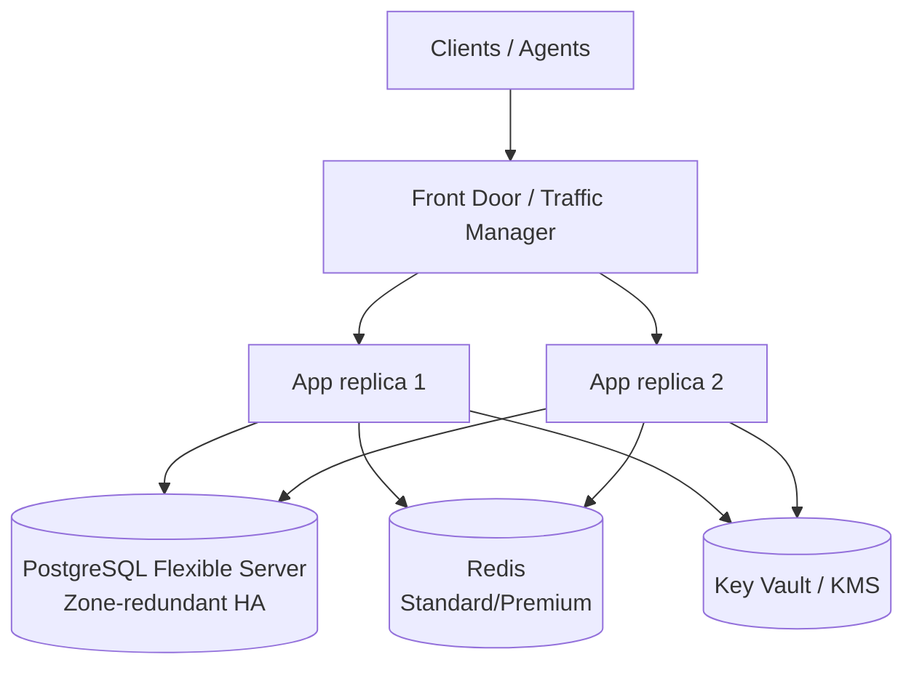

# High Availability & Multi-Region

How to run Plaidify with no single point of failure and how to extend it to a
multi-region, active-passive topology. Pair this with
[DISASTER_RECOVERY.md](DISASTER_RECOVERY.md) (backup/restore/failover) and
[RELIABILITY_DESIGN.md](RELIABILITY_DESIGN.md) (in-app resilience).

## Design principle: a stateless app tier

The Plaidify API is stateless — all durable state lives in PostgreSQL, with
Redis holding only ephemeral rate-limit/session data and the browser pool being
per-instance and disposable. That means **HA is achieved by running ≥2 app
replicas behind a load balancer plus HA backing services** — no app-side
changes required.



## Single-region HA (within one region)

| Tier | Make it HA | How |
| ---- | ---------- | --- |
| **App (Container Apps)** | ≥2 replicas across zones | Set `minReplicas: 2+`. Zone redundancy requires a **VNet-injected** environment (`infrastructureSubnetId`) in a zone-enabled region — see below. |
| **PostgreSQL** | Zone-redundant HA | Set `postgresSkuTier=GeneralPurpose` (HA isn't available on Burstable) and `postgresHighAvailabilityMode=ZoneRedundant` (now parameterized in `infra/main.bicep`). A hot standby in another zone fails over automatically. |
| **Redis** | Replication / zones | Use `redisSkuName=Standard` (primary+replica, 99.9% SLA) or `Premium` for zone redundancy. |
| **Backups** | Geo-redundant | Set `postgresGeoRedundantBackup=true` for cross-region restore capability. |

### Enabling Postgres zone-redundant HA

```bicep
// main.bicepparam
param postgresSkuTier = 'GeneralPurpose'
param postgresSkuName = 'GP_Standard_D2ds_v5'
param postgresHighAvailabilityMode = 'ZoneRedundant'
param postgresStandbyAvailabilityZone = '2'
param postgresGeoRedundantBackup = true
```

### Enabling Container Apps zone redundancy

Zone redundancy for the managed environment requires VNet injection. Create the
environment with an `infrastructureSubnetId` and `zoneRedundant: true`, then run
the app with `minReplicas: 2+` so replicas spread across zones. This is a
networking change beyond the default template — plan a VNet + delegated subnet
(`/23` or larger) and set the subnet on the `Microsoft.App/managedEnvironments`
resource.

## Multi-region (active-passive)

For regional-failure survival, run a warm standby in a second region:

1. **Database** — enable geo-redundant backups (above) and/or create a
   cross-region **read replica** that can be promoted. RPO depends on
   replication lag (seconds) vs. geo-backup (up to the backup interval).
2. **Secrets & keys** — replicate Key Vault secrets to the standby region and
   use the **same** `ENCRYPTION_KEY` / KMS key (Azure Key Vault supports
   multi-region access; AWS KMS supports multi-region keys). Without identical
   key material the standby cannot decrypt credentials — see
   [KMS_INTEGRATION.md](KMS_INTEGRATION.md).
3. **Global entry point** — front both regions with **Azure Front Door** (or
   Traffic Manager) using health-probe-based priority routing: primary first,
   standby on failure.
4. **Redis** — stand up a regional instance per region; it is not the source of
   truth, so no cross-region replication is required.

### Failover

1. Confirm the primary is unhealthy (Front Door probes / `/health/detailed`).
2. Promote the standby database (read replica) or restore from geo-backup
   (see [DISASTER_RECOVERY.md](DISASTER_RECOVERY.md)).
3. Point the standby app at the promoted DB; verify `/health/detailed` reports
   `database`, `redis`, and `kms` all `ok`.
4. Front Door shifts traffic automatically once the standby is healthy.

### Targets

| Topology | RPO | RTO |
| -------- | --- | --- |
| Single-region zone-redundant | ~0 (sync standby) | seconds–minutes (automatic) |
| Multi-region, read replica | seconds (replication lag) | minutes (promote + cut over) |
| Multi-region, geo-backup only | ≤ backup interval | ~1 hour (restore drill validated) |

## Capacity & scaling

Validate replica counts and autoscale rules against real load before relying on
them — see [LOAD_TESTING.md](LOAD_TESTING.md). Scale the app tier on CPU/RPS and
size the browser pool (`BROWSER_POOL_SIZE`) and access-executor replicas to the
expected concurrent extraction volume.
