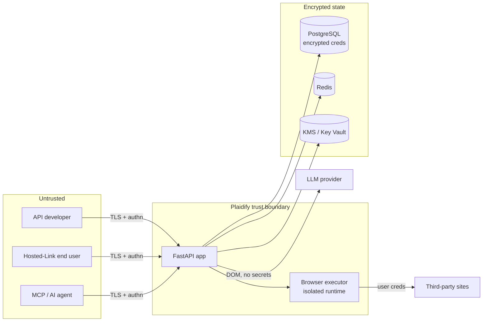

# Threat Model

A STRIDE-based threat model for Plaidify. It complements
[SECURITY.md](../SECURITY.md) (architecture) and [COMPLIANCE.md](COMPLIANCE.md)
(controls matrix), and is intended to scope security reviews and penetration
tests.

## Scope & assets

Plaidify brokers authenticated access to third-party sites on a user's behalf.
The crown-jewel assets are:

1. **Stored site credentials** — encrypted username/password per user (envelope-encrypted).
2. **Master / KMS key material** — unwraps the per-user DEKs.
3. **Auth tokens** — JWTs, refresh tokens, API keys, consent grants.
4. **The audit log** — tamper-evident record of access.

## Trust boundaries

## STRIDE analysis

| # | Category | Threat | Mitigations (implemented) | Residual risk / operator action |
| - | -------- | ------ | ------------------------- | ------------------------------- |
| 1 | **Spoofing** | Forged identity / stolen token | Signed JWTs, rotating refresh tokens, hashed API keys, OAuth2 with verified email + Google audience check, account lockout | Use short token TTLs; consider end-user MFA; protect the signing key |
| 2 | **Spoofing** | OAuth token substitution (confused deputy) | Google `tokeninfo` audience check vs `OAUTH_GOOGLE_CLIENT_ID`; GitHub tokens are app-scoped | Set the client id; restrict providers via `OAUTH_ALLOWED_PROVIDERS` |
| 3 | **Tampering** | Modify data in transit | TLS/HSTS, strict CORS, request-size limits, security headers | Terminate TLS correctly; pin `CORS_ORIGINS` |
| 4 | **Tampering** | Alter audit history | SHA-256 hash-chained audit log + `/audit/verify` | Periodically verify the chain; ship logs to WORM storage |
| 5 | **Repudiation** | Deny performing an action | Per-action audit entries (user/agent, IP, scope, timestamp) | Retain logs per policy; centralize off-host |
| 6 | **Info disclosure** | Theft of stored credentials | Envelope encryption (per-user DEK), KMS-wrapped master key, no plaintext at rest | Use managed KMS (HSM); least-privilege DB access |
| 7 | **Info disclosure** | Secrets in logs / errors | PII-safe structured logging; `DEBUG=false` in prod (enforced) | Review custom log statements; scrub sink integrations |
| 8 | **Info disclosure** | Credentials leak to the LLM | Only simplified DOM (no secrets) is sent to the model; browser guardrails | Review connector prompts; prefer self-hosted models for sensitive sites |
| 9 | **Info disclosure** | Health/metrics expose internals | `/health/detailed` token-gated; `/metrics` not public by default | Keep metrics/Grafana behind auth/VPN |
| 10 | **DoS** | Request flooding / abusive load | Rate limiting (Redis-backed, fail-open), request-size cap, circuit breakers, autoscale | Add edge WAF/DDoS protection; tune limits |
| 11 | **DoS** | Stuck backend hangs requests | Bounded health probes, browser-pool circuit breaker, timeouts, graceful shutdown | Size the browser pool; alert on saturation |
| 12 | **Elevation of privilege** | Normal user gains admin | RBAC (`is_admin`), admins can't self-deactivate, scoped keys/agents | Review admin grants; audit `promote` events |
| 13 | **Elevation of privilege** | Agent exceeds granted scope | Consent scopes + expiry, per-agent allowed sites/scopes, isolated executor | Grant minimal scopes; expire grants promptly |
| 14 | **Elevation of privilege** | Malicious target-site content (SSRF/RCE via browser) | Isolated access runtime, read-only browser guardrails, no secret exfil to LLM | Run executors network-segmented; keep Chromium patched |

## Residual risks & assumptions

- **Key custody:** with `KMS_PROVIDER=local`, the master key is an env secret — its compromise exposes all credentials. Use managed HSM-backed KMS in production.
- **Compromised dependencies:** mitigated by `pip-audit`/CodeQL/Dependabot, but a zero-day in a transitive dep is a residual risk — patch promptly.
- **Insider access to the database host:** data is encrypted at rest, but a host with both DB and master-key access can decrypt. Separate the KMS blast radius (see [KMS_INTEGRATION.md](KMS_INTEGRATION.md)).
- **Target-site abuse:** Plaidify acts with user-delegated credentials; per-site allow-lists and consent scopes limit blast radius.

Re-run this analysis when adding a trust boundary (new external integration, new
client surface, or a change to where credentials/keys flow).
