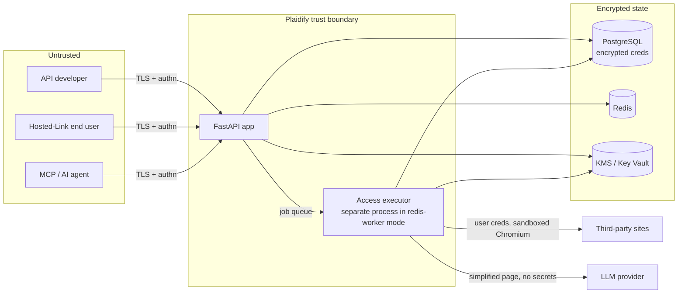

# Threat Model

A STRIDE-based threat model for Plaidify. It complements
[SECURITY.md](../SECURITY.md) (how each control works, and its known limits)
and [COMPLIANCE.md](COMPLIANCE.md) (controls matrix), and is meant to scope
security reviews and penetration tests. Mitigations listed here are the ones
in the code today.

## Scope & assets

Plaidify brokers authenticated access to third-party sites on a user's behalf.
The crown-jewel assets are:

1. **Stored site credentials** — username/password per link, encrypted under the owner's data key.
2. **Master / KMS key material** — unwraps the per-user data keys.
3. **Auth tokens** — access and refresh tokens, API keys, launch tokens, consent grants, public tokens.
4. **Extracted data** — job results (stored encrypted, erased after `RESULT_RETENTION_DAYS`).
5. **The audit log** — tamper-evident record of access.

## Trust boundaries

```mermaid
flowchart LR
  subgraph Untrusted
    dev[API developer]
    user[Hosted-Link end user]
    agent[MCP / AI agent]
  end
  subgraph Plaidify [Plaidify trust boundary]
    api[FastAPI app]
    exec[Access executor<br/>separate process in redis-worker mode]
  end
  subgraph Data [Encrypted state]
    db[(PostgreSQL<br/>encrypted creds)]
    redis[(Redis)]
    kms[(KMS / Key Vault)]
  end
  ext[Third-party sites]
  llm[LLM provider]

  dev & user & agent -->|TLS + authn| api
  api --> db
  api --> redis
  api --> kms
  api -->|job queue| exec
  exec --> db
  exec --> kms
  exec -->|user creds, sandboxed Chromium| ext
  exec -->|simplified page, no secrets| llm
```

The executor holds the same secrets as the API (`ENCRYPTION_KEY`, the
database credentials); Chromium's sandbox, not a separate trust zone, is what
stands between a hostile page and them. In `inprocess` mode the API process
runs the browser itself.

## STRIDE analysis

| # | Category | Threat | Mitigations (implemented) | Residual risk / operator action |
| - | -------- | ------ | ------------------------- | ------------------------------- |
| 1 | **Spoofing** | Forged identity / stolen token | Access tokens bound to `typ`/`aud` and the user's token version (reset, sign-out-everywhere and deactivation end them); rotating refresh tokens stored as hashes, reuse revokes the family; hashed API keys only in `X-API-Key`; launch tokens with their own key and audience; sign-in throttling per username+address and per username | Registration reveals whether a username or email exists; Plaidify accounts have no MFA of their own; protect `JWT_SECRET_KEY` and set `LINK_LAUNCH_SECRET` |
| 2 | **Spoofing** | OAuth token substitution (confused deputy) | Google tokens audience-checked against `OAUTH_GOOGLE_CLIENT_ID`, GitHub tokens checked against the configured GitHub app; startup refuses an enabled provider without its ids; only verified emails link to existing accounts | Restrict providers with `OAUTH_ALLOWED_PROVIDERS` |
| 3 | **Tampering** | Modify data in transit | TLS/HSTS with HTTPS redirect, RSA-OAEP credential encryption from the hosted page, the Python SDK and the native screens, strict CORS, body-size cap (chunked uploads too), security headers | Terminate TLS correctly; trust only your proxy (`FORWARDED_ALLOW_IPS`) |
| 4 | **Tampering** | Alter audit history | HMAC-SHA256 chain keyed outside the database (`AUDIT_HMAC_KEY`), serialized appends, a signed head row (truncation is detected), signed checkpoints on pruning, admin-only `/audit/verify` | Keep `AUDIT_HMAC_KEY` in a secrets manager; verify periodically; ship logs to WORM storage |
| 5 | **Repudiation** | Deny performing an action | Per-action audit entries (user or agent, client address, token fingerprint, timestamp) | Retain logs per policy; centralize off-host |
| 6 | **Info disclosure** | Theft of stored credentials or results | Per-user envelope encryption of credentials, job results and webhook secrets/payloads; KMS-wrapped keys; least-privilege database role (Azure template, `scripts/provision_app_db_role.py`) | Use a managed, HSM-backed KMS; keep backups encrypted (`scripts/backup_db.sh`) |
| 7 | **Info disclosure** | Secrets in logs, URLs or errors | Secrets only in request bodies; access logs redact secret query parameters and token path segments; tokens logged as fingerprints; typed values masked in browser errors; `DEBUG=false` enforced in production | Review custom log statements and log-sink integrations |
| 8 | **Info disclosure** | Credentials or tokens leak to the LLM | The model gets a simplified page without hidden inputs or password values, secret-looking URL parameters redacted, and is told to treat it as data; values not on the page are dropped | Prefer a self-hosted model for sensitive sites |
| 9 | **Info disclosure** | Health, metrics or schema expose internals | In production `/health/detailed` needs `HEALTH_CHECK_TOKEN` (404 otherwise) and `/docs`/`/openapi.json` are off; `/metrics` takes `METRICS_TOKEN` | `/metrics` is open when `METRICS_TOKEN` is unset: set it wherever the port is reachable (the Azure template always sets one) |
| 10 | **DoS** | Request flooding / abusive load | Rate limits on sign-in, registration, password reset, `/connect`, MFA and key generation; a default limit per client address and path on every other endpoint; per-agent limits; per-site limits from blueprints; body-size cap; circuit breakers | Limits are per client address, so a distributed flood still needs an edge WAF / rate limiter |
| 11 | **DoS** | Stuck backend or job hangs work | Bounded health probes, job deadlines and heartbeats, a reaper for orphaned jobs, graceful drain, browser circuit breaker, per-credential locks | Size the browser pool; alert on saturation (monitoring/) |
| 12 | **Elevation of privilege** | Normal user gains admin | RBAC (`is_admin`); the bootstrap step only creates its account, never promotes one; admins can't deactivate themselves; blueprint generation is admin-only | Review admin grants; audit `promote_user` events |
| 13 | **Elevation of privilege** | Agent exceeds granted scope | Consent grants bound to the agent; key, agent, token and consent scopes intersected (`[]` denies all); agents cannot approve consent; job results filtered to the caller's scopes and sites | Grant minimal scopes; expire and revoke grants promptly |
| 14 | **Elevation of privilege** | Malicious target-site content (SSRF, browser exploit) | Private/loopback/link-local/CGNAT/metadata addresses refused on every request; domain scoping; per-phase read-only rules; `execute_js` only for trusted blueprints; TLS verification; service workers blocked; Chromium sandbox | The executor holds the master secrets (see above); a first redirect-hop GET can go out before a run is stopped; keep Chromium patched and the sandbox on |
| 15 | **Tampering** | Malicious or broken blueprint (registry, generated, user-supplied) | Strict schema validation (unknown keys rejected); non-bundled blueprints are untrusted: no JavaScript, never private networks; declared submit and logout targets; registry sites are owned by their publisher | Review blueprints before adding them to `CONNECTORS_DIR`; list only reviewed ones in `ENGINE_TRUSTED_CONNECTORS`; Python connectors run as trusted code |

## Residual risks & assumptions

- **Key custody:** with `KMS_PROVIDER=local`, the master key is an env secret — its compromise exposes all credentials. Use managed HSM-backed KMS in production.
- **Shared process:** the browser runs next to the master secrets; per-job isolation ([ISOLATED_ACCESS_RUNTIME.md](ISOLATED_ACCESS_RUNTIME.md)) is designed, not built.
- **Compromised dependencies:** mitigated by hash-locked installs, `pip-audit`/`npm audit` in CI and weekly, CodeQL and Dependabot, but a zero-day in a transitive dependency remains a risk — patch promptly.
- **Insider access to the database host:** data is encrypted at rest, but a host with both database and master-key access can decrypt. Separate the KMS blast radius (see [KMS_INTEGRATION.md](KMS_INTEGRATION.md)).
- **Target-site abuse:** Plaidify acts with user-delegated credentials; per-site allow-lists, the read-only policy and consent scopes limit the blast radius. The read-only policy allows JSON POSTs after login (single-page apps read that way).

Re-run this analysis when adding a trust boundary (new external integration, new
client surface, or a change to where credentials/keys flow).
